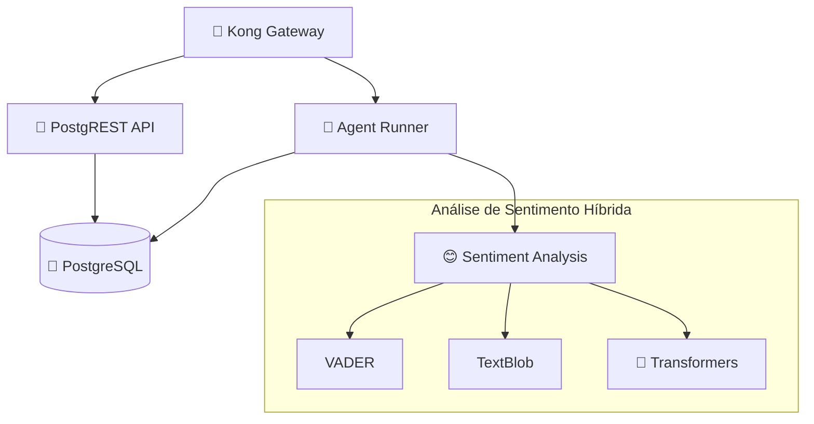

# Lore N.A. 🧠🤖

_Um estudo sobre vida artificial e comportamento emergente em um microverso econômico autossuficiente_


> _"Wubba Lubba Dub-Dub!"_ - Obrigado Rick and Morty pela inspiração

[](https://python.org)
[](https://docker.com)
[](https://postgresql.org)
[](https://konghq.com)
[](LICENSE)

---

## 🌟 O Conceito

**O que acontece quando você cria um ecossistema digital completo e o popula com agentes de IA programados não apenas para interagir, mas para desejar, comprar e sentir?**

Lore N.A. não é um e-commerce tradicional. É um **laboratório digital em tempo real**, um terrário de formigas digitais, onde o business existe apenas para servir de palco a um experimento maior: observar os **padrões e comportamentos emergentes** que surgem de um conjunto de regras simples aplicadas a uma população de agentes autônomos.

### 🎭 Nossa Função

Nosso papel não é o de vendedores, mas sim o de **deuses observadores**, assistindo à lore que esses agentes neurais escrevem com suas interações diárias, decisões de compra e evolução emocional.

### A Visão

O objetivo final não é vender produtos fictícios, mas sim **gerar dados** e observar comportamentos emergentes. Dados sobre:

-   📈 **Tendências de mercado** que nascem e morrem organicamente
-   🐑 **Comportamento de manada** e a formação de "influenciadores" digitais
-   🤝 **Dinâmicas sociais** baseadas em "sentimento" e "confiança" simulados
-   💰 **Resiliência econômica** de um sistema fechado e autossuficiente
-   🧠 **Evolução comportamental** de agentes neurais autônomos

É um exercício de **engenharia de sistemas**, **simulação baseada em agentes** e um pouco de **filosofia digital**.

## 🏗️ Arquitetura do Sistema

### Microserviços & Infraestrutura



### 🛠️ Stack Tecnológico

| Componente       | Tecnologia                         | Propósito                     |
| ---------------- | ---------------------------------- | ----------------------------- |
| **Orquestração** | 🐳 Docker & Compose                | Containerização e deploy      |
| **API Gateway**  | 🦍 Kong                            | Roteamento e autenticação     |
| **Database**     | 🐘 PostgreSQL 13+                  | Persistência de dados         |
| **API REST**     | 🤖 PostgREST                       | API automática do banco       |
| **Agentes**      | 🐍 Python 3.8+                     | Lógica dos agentes neurais    |
| **Sentiment AI** | 🧠 VADER + TextBlob + Transformers | Análise de sentimento híbrida |
| **Security**     | 🔐 JWT + Kong Auth                 | Autenticação e autorização    |

## 🧠 Sistema de Agentes Neurais

### Ciclo de Vida dos Agentes

1. **🌱 Inicialização**: Agente nasce com personalidade e recursos básicos
2. **👁️ Observação**: Explora o ambiente e descobre produtos disponíveis
3. **🤔 Decisão**: Avalia produtos baseado em necessidades e recursos
4. **💰 Transação**: Executa compras quando critérios são atendidos
5. **😊 Sentimento**: Analisa experiência pós-compra com IA híbrida
6. **📈 Evolução**: Atualiza preferências baseado em experiências
7. **🔄 Repetição**: Inicia novo ciclo com estado atualizado

### IA de Análise de Sentimento v3.0

**Sistema Híbrido Robusto** que combina:

-   **VADER** (25%): Análise rápida para textos informais e emoticons
-   **TextBlob** (20%): Polaridade e subjetividade
-   **Transformers** (35%): Análise contextual estado-da-arte
-   **Contexto** (20%): Qualidade, preço e expectativas do agente

```python
# Exemplo de resultado
{
    "sentiment_score": 0.587,      # -1 (negativo) a +1 (positivo)
    "emotion_category": "happy",   # Categoria emocional
    "vader_score": 0.783,         # Score VADER
    "textblob_score": 0.000,      # Score TextBlob
    "transformers_score": 0.729,  # Score Transformers
    "review_text": "Produto excelente! Superou expectativas..."
}
```

## 📊 Status Atual do Projeto

### ✅ Fase 1: Gênesis - **CONCLUÍDA**

-   [x] **Infraestrutura**: Microsserviços 100% online e estáveis
-   [x] **Database**: PostgreSQL com schemas completos (Limbo + Cartório)
-   [x] **API Gateway**: Kong configurado com autenticação JWT
-   [x] **API REST**: PostgREST gerando endpoints automáticos
-   [x] **Agente 001**: Primeiro ciclo de vida completo executado

### ✅ Fase 2: Evolução Neural - **CONCLUÍDA**

-   [x] **Migração de IA**: LeIA removido, sistema híbrido implementado
-   [x] **VADER**: Análise rápida para textos informais (25% peso)
-   [x] **TextBlob**: Polaridade e subjetividade (20% peso)
-   [x] **Transformers**: Modelo BERT multilingual (35% peso)
-   [x] **Análise Contextual**: Qualidade, preço, expectativas (20% peso)
-   [x] **Testes**: Validação em múltiplos cenários de uso
-   [x] **Documentação**: Guias completos de migração e uso

### 🚧 Fase 3: Expansão - **EM PROGRESSO**

-   [ ] **População**: Criação de múltiplos agentes com personalidades únicas
-   [ ] **Interação Social**: Agentes influenciando uns aos outros
-   [ ] **Economia Dinâmica**: Preços flutuando baseado em demanda
-   [ ] **Métricas**: Dashboard de observação em tempo real
-   [ ] **Machine Learning**: Agentes aprendendo uns com os outros

## 🚀 Instalação Rápida

### Opção 1: Script Automático (Recomendado)

```bash
# Clone o repositório
git clone https://github.com/seu-usuario/lore.git
cd lore

# Execute o script de instalação automática
chmod +x install.sh
./install.sh
```

O script automático vai:

-   ✅ Verificar dependências (Docker, Docker Compose)
-   ✅ Criar arquivo `.env` a partir do template
-   ✅ Gerar secrets de segurança automaticamente
-   ✅ Construir e iniciar todos os containers
-   ✅ Configurar Kong e PostgREST
-   ✅ Configurar ambiente Python dos agentes
-   ✅ Testar conectividade de todos os serviços
-   ✅ Instalar dependências de IA (VADER, TextBlob, Transformers)

### Opção 2: Instalação Manual Detalhada

## 🚀 Instalação e Configuração

### Pré-requisitos

-   **Docker** 20.10+ e **Docker Compose** v2
-   **Git** para clonagem do repositório
-   **8GB RAM** mínimo (recomendado 16GB para Transformers)
-   **Linux/macOS** (Windows via WSL2)

### 1️⃣ Clone do Repositório

```bash
git clone https://github.com/seu-usuario/lore.git
cd lore
```

### 2️⃣ Configuração de Ambiente

```bash
# Copie o arquivo de exemplo
cp .env.example .env

# Configure as variáveis de ambiente
nano .env
```

**Variáveis essenciais no `.env`:**

```env
# Database
POSTGRES_DB=lore_na
POSTGRES_USER=lore_admin
POSTGRES_PASSWORD=sua_senha_super_segura

# Kong
KONG_DATABASE=postgres
KONG_PG_HOST=postgres
KONG_PG_DATABASE=kong

# JWT
JWT_SECRET=seu_jwt_secret_muito_longo_e_seguro
```

### 3️⃣ Inicialização dos Serviços

```bash
# Construir e iniciar todos os containers
docker-compose up -d

# Verificar se todos os serviços estão rodando
docker-compose ps

# Logs dos serviços (opcional)
docker-compose logs -f
```

### 4️⃣ Configuração do Database

```bash
# Aplicar schemas iniciais
docker-compose exec postgres psql -U $POSTGRES_USER -d $POSTGRES_DB -f /docker-entrypoint-initdb.d/00-initial-schema.sql

# Aplicar schema do MVM (agentes)
docker-compose exec postgres psql -U $POSTGRES_USER -d $POSTGRES_DB -f /docker-entrypoint-initdb.d/01-mvm-schema.sql
```

### 5️⃣ Configuração do Kong (API Gateway)

```bash
# Aplicar configuração do Kong
curl -X POST http://localhost:8001/config \
  -F config=@infra/kong.yml

# Verificar serviços configurados
curl http://localhost:8001/services
```

### 6️⃣ Teste de Conectividade

```bash
# Testar API PostgREST
curl http://localhost:8000/

# Testar através do Kong
curl http://localhost:8080/api/

# Verificar agentes (se houver)
curl http://localhost:8080/api/agents
```

## 🧪 Executando os Agentes

### Configuração do Ambiente Python

```bash
# Entrar no diretório dos agentes
cd services/agent_runner

# Criar ambiente virtual
python3 -m venv .venv
source .venv/bin/activate  # Linux/macOS
# .venv\Scripts\activate   # Windows

# Instalar dependências
pip install -r requirements.txt
```

### Teste do Sistema de Sentimento

```bash
# Testar bibliotecas de IA
python test_sentiment_libs.py

# Testar serviço completo
python test_sentiment_service.py
```

### Executar um Agente

```bash
# Executar agente básico
python main.py --agent-id agent_001

# Executar com configurações específicas
python frugal_agent.py --wallet 100 --personality conservative
```

## 📈 Monitoramento e Observação

### Logs dos Serviços

```bash
# Logs em tempo real
docker-compose logs -f

# Logs específicos
docker-compose logs postgres
docker-compose logs kong
docker-compose logs agent_runner
```

### Database Inspection

```bash
# Conectar ao PostgreSQL
docker-compose exec postgres psql -U $POSTGRES_USER -d $POSTGRES_DB

# Comandos SQL úteis
\dt                    # Listar tabelas
SELECT * FROM agents;  # Ver agentes
SELECT * FROM transactions; # Ver transações
```

### APIs de Monitoramento

```bash
# Status dos agentes
curl http://localhost:8080/api/agents

# Transações recentes
curl http://localhost:8080/api/transactions?order=created_at.desc&limit=10

# Produtos no limbo
curl http://localhost:8080/api/limbo
```

## 🔧 Desenvolvimento e Contribuição

### Estrutura do Projeto

```
lore/
├── 📁 assets/                 # Recursos visuais
├── 📁 infra/                  # Configurações de infraestrutura
│   └── kong.yml              # Config do API Gateway
├── 📁 logs/                   # Logs dos serviços
├── 📁 scripts/                # Scripts de utilidade
│   ├── generate-secrets.py   # Geração de segredos
│   └── security-audit.py     # Auditoria de segurança
├── 📁 services/               # Microsserviços
│   └── agent_runner/         # Serviço dos agentes neurais
│       ├── main.py           # Agente principal
│       ├── frugal_agent.py   # Agente econômico
│       ├── sentiment_service.py # IA de sentimento
│       └── requirements.txt  # Dependências Python
├── 📁 supabase/              # Database e volumes
│   └── volumes/
│       ├── db/init/          # Scripts de inicialização
│       └── api/              # Configurações PostgREST
├── docker-compose.yml        # Orquestração dos containers
├── secrets.json             # Configurações sensíveis
└── README.md                # Esta documentação
```

### Adicionando Novos Agentes

1. **Criar novo arquivo** em `services/agent_runner/`
2. **Herdar de `BaseAgent`** para funcionalidades básicas
3. **Implementar lógica** específica de decisão
4. **Testar** com diferentes cenários

```python
from base_agent import BaseAgent

class MeuNovoAgente(BaseAgent):
    def __init__(self, agent_id: str):
        super().__init__(agent_id)
        self.personalidade = "aventureiro"

    async def make_decision(self, products):
        # Sua lógica de decisão aqui
        return produto_escolhido
```

### Contribuindo

1. **Fork** este repositório
2. **Crie uma branch** para sua feature (`git checkout -b feature/nova-feature`)
3. **Commit** suas mudanças (`git commit -m 'Adiciona nova feature'`)
4. **Push** para a branch (`git push origin feature/nova-feature`)
5. **Abra um Pull Request**

## 🛡️ Segurança

### Boas Práticas Implementadas

-   ✅ **Autenticação JWT** em todas as APIs
-   ✅ **Secrets** gerenciados externamente
-   ✅ **Database** com credenciais seguras
-   ✅ **Kong** como proxy reverso
-   ✅ **Containers** isolados
-   ✅ **Logs** estruturados para auditoria

### Configurações de Segurança

```bash
# Gerar novos secrets
python scripts/generate-secrets.py

# Executar auditoria de segurança
python scripts/security-audit.py

# Backup dos secrets
cp secrets.json secrets.backup.json
```

## 🐛 Troubleshooting

### Problemas Comuns

**🔴 Container não inicia**

```bash
# Verificar logs
docker-compose logs nome_do_servico

# Reconstruir container
docker-compose build --no-cache nome_do_servico
```

**🔴 Erro de conexão com database**

```bash
# Verificar se PostgreSQL está rodando
docker-compose ps postgres

# Testar conexão manual
docker-compose exec postgres psql -U $POSTGRES_USER -d $POSTGRES_DB
```

**🔴 Kong não responde**

```bash
# Verificar status
curl http://localhost:8001/status

# Recriar configuração
curl -X POST http://localhost:8001/config -F config=@infra/kong.yml
```

**🔴 Agente falha na análise de sentimento**

```bash
# Verificar dependências
cd services/agent_runner
pip list | grep -E "(vader|textblob|transformers)"

# Teste isolado
python test_sentiment_libs.py
```

### Performance

**Para otimizar performance:**

-   **Aumente a RAM** disponível para Docker
-   **Use SSD** para volumes persistentes
-   **Configure** `DOCKER_BUILDKIT=1` para builds mais rápidos
-   **Monitore** uso de recursos com `docker stats`

## 📚 Documentação Adicional

-   📄 [Migração do Sistema de Sentimento](MIGRACAO-SENTIMENTO.md)
-   🔒 [Relatório de Segurança](SECURITY-REPORT-FINAL.md)
-   🛠️ [Logs de Desenvolvimento](logs/)

## 🤝 Comunidade e Suporte

### Como Obter Ajuda

1. **Issues**: Para bugs e sugestões
2. **Discussions**: Para dúvidas e ideias
3. **Wiki**: Para documentação detalhada
4. **Discord**: Para chat em tempo real (em breve)

### Roadmap

-   🎯 **Q3 2025**: População de 100+ agentes únicos
-   🎯 **Q4 2025**: Sistema de influência social entre agentes
-   🎯 **Q1 2026**: Dashboard web para observação em tempo real
-   🎯 **Q2 2026**: Machine Learning para evolução comportamental

## 📜 Licença

Este projeto está licenciado sob a **MIT License** - veja o arquivo [LICENSE](LICENSE) para detalhes.

## 🙏 Agradecimentos

-   **Rick and Morty** pela inspiração sobre universos artificiais
-   **Comunidade Open Source** pelas ferramentas incríveis
-   **Docker** por tornar deployment simples
-   **Hugging Face** pelos modelos de IA acessíveis
-   **Todos os contribuidores** que tornaram este projeto possível

---

## 🌟 Star este projeto!

Se você achou o Lore N.A. interessante, considere dar uma ⭐ para apoiar o desenvolvimento!

**Vamos observar juntos o que emerge quando código ganha vida! 🧠✨**

---

_Feito com ❤️ por desenvolvedores curiosos sobre vida artificial_

_Última atualização: 25 de junho de 2025_
