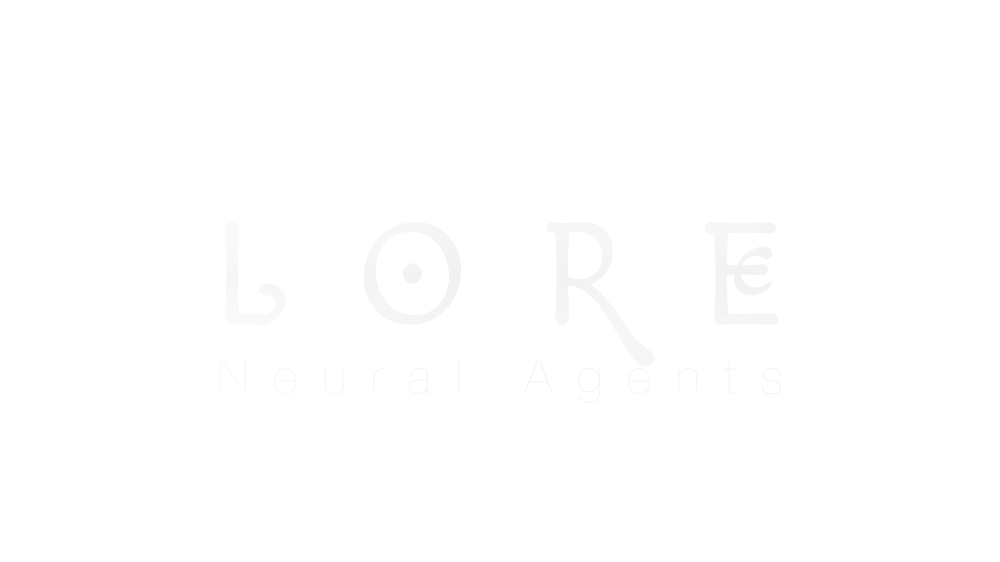
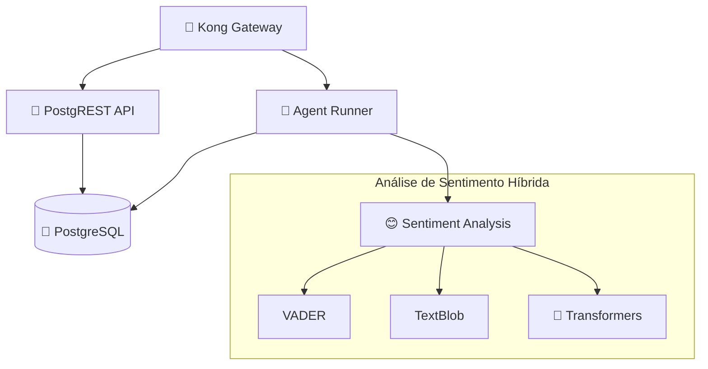

# Lore N.A.

_Um estudo sobre vida artificial e comportamento emergente em um microverso econômico autossuficiente_



> Obrigado Rick and Morty pela inspiração

[](https://python.org)
[](https://docker.com)
[](https://postgresql.org)
[](https://konghq.com)
[](LICENSE)

---

## 🚀 Instalação Rápida (2 minutos)

### **Opção 1: Auto-Setup (Recomendado)**

```bash
# Clonar repositório
git clone https://github.com/your-username/lore.git
cd lore

# Executar setup automático
bash setup.sh

# OU navegar diretamente e executar o launcher
cd services/agent_runner
python3 advanced_launcher.py
```

### **Opção 2: Manual**

```bash
# Clonar e instalar dependências
git clone https://github.com/your-username/lore.git
cd lore/services/agent_runner
pip install -r requirements.txt

# Executar sistema
python3 advanced_launcher.py
```

### **✅ Pronto! Acesse:**

-   **Dashboard:** http://localhost:8501
-   **API:** http://localhost:8000/docs

### **📋 Requisitos:**

-   **Linux/macOS:** Python 3.8+ e pip
-   **Windows 11:** Veja [WINDOWS-INSTALL.md](WINDOWS-INSTALL.md) (apenas Python necessário)

---

## 🌟 O Conceito

**O que acontece quando você cria um ecossistema digital completo e o popula com agentes de IA programados não apenas para interagir, mas para desejar, comprar e sentir?**

Lore N.A. não é um e-commerce tradicional. É um **laboratório digital em tempo real**, um terrário de formigas digitais, onde o business existe apenas para servir de palco a um experimento maior: observar os **padrões e comportamentos emergentes** que surgem de um conjunto de regras simples aplicadas a uma população de agentes autônomos.

### 🎭 Nossa Função

Nosso papel não é o de vendedores, mas sim o de **deuses observadores**, assistindo à lore que esses agentes neurais escrevem com suas interações diárias, decisões de compra e evolução emocional.

### A Visão

O objetivo final não é vender produtos fictícios, mas sim **gerar dados** e observar comportamentos emergentes. Dados sobre:

-   📈 **Tendências de mercado** que nascem e morrem organicamente
-   🐑 **Comportamento de manada** e a formação de "influenciadores" digitais
-   🤝 **Dinâmicas sociais** baseadas em "sentimento" e "confiança" simulados
-   💰 **Resiliência econômica** de um sistema fechado e autossuficiente
-   🧠 **Evolução comportamental** de agentes neurais autônomos

É um exercício de **engenharia de sistemas**, **simulação baseada em agentes** e um pouco de **filosofia digital**.

## 🏗️ Arquitetura do Sistema

### Microserviços & Infraestrutura



### 🛠️ Stack Tecnológico

| Componente       | Tecnologia                         | Propósito                     |
| ---------------- | ---------------------------------- | ----------------------------- |
| **Orquestração** | 🐳 Docker & Compose                | Containerização e deploy      |
| **API Gateway**  | 🦍 Kong                            | Roteamento e autenticação     |
| **Database**     | 🐘 PostgreSQL 13+                  | Persistência de dados         |
| **API REST**     | 🤖 PostgREST                       | API automática do banco       |
| **Agentes**      | 🐍 Python 3.8+                     | Lógica dos agentes neurais    |
| **Sentiment AI** | 🧠 VADER + TextBlob + Transformers | Análise de sentimento híbrida |
| **Security**     | 🔐 JWT + Kong Auth                 | Autenticação e autorização    |

## 🧠 Sistema de Agentes Neurais

### Ciclo de Vida dos Agentes

1. **🌱 Inicialização**: Agente nasce com personalidade e recursos básicos
2. **👁️ Observação**: Explora o ambiente e descobre produtos disponíveis
3. **🤔 Decisão**: Avalia produtos baseado em necessidades e recursos
4. **💰 Transação**: Executa compras quando critérios são atendidos
5. **😊 Sentimento**: Analisa experiência pós-compra com IA híbrida
6. **📈 Evolução**: Atualiza preferências baseado em experiências
7. **🔄 Repetição**: Inicia novo ciclo com estado atualizado

### IA de Análise de Sentimento v3.0

**Sistema Híbrido Robusto** que combina:

-   **VADER** (25%): Análise rápida para textos informais e emoticons
-   **TextBlob** (20%): Polaridade e subjetividade
-   **Transformers** (35%): Análise contextual estado-da-arte
-   **Contexto** (20%): Qualidade, preço e expectativas do agente

```python
# Exemplo de resultado
{
    "sentiment_score": 0.587,      # -1 (negativo) a +1 (positivo)
    "emotion_category": "happy",   # Categoria emocional
    "vader_score": 0.783,         # Score VADER
    "textblob_score": 0.000,      # Score TextBlob
    "transformers_score": 0.729,  # Score Transformers
    "review_text": "Produto excelente! Superou expectativas..."
}
```

## 🧬 Genesis Protocol: DNA Digital e Evolução

**REVOLUÇÃO**: O Lore N.A. agora implementa **evolução darwiniana real** com DNA digital! Cada agente possui genes únicos que influenciam seu comportamento nos 5 universos.

### DNA Digital por Universo

```python
# Estrutura do DNA de um agente
AgentDNA = {
    "limbo_genes": {
        "risk_tolerance": 0.8,      # Tolerância a risco no mercado
        "price_sensitivity": 0.3,   # Sensibilidade a preços
        "quality_preference": 0.9,  # Preferência por qualidade
        "novelty_seeking": 0.6,     # Busca por novidades
        "brand_loyalty": 0.4        # Lealdade a marcas
    },
    "odyssey_genes": {
        "creativity_drive": 0.9,    # Impulso criativo
        "experimentation": 0.7,     # Tendência experimental
        "aesthetic_bias": "minimalist" # Bias estético
    },
    "ritual_genes": {
        "community_bonding": 0.8,   # Ligação comunitária
        "influence_susceptibility": 0.4, # Suscetibilidade a influência
        "leadership_tendency": 0.6   # Tendência de liderança
    },
    "engine_genes": {
        "analytical_thinking": 0.7,  # Pensamento analítico
        "pattern_recognition": 0.8,  # Reconhecimento de padrões
        "strategic_planning": 0.5    # Planejamento estratégico
    },
    "logs_genes": {
        "patience_level": 0.6,      # Nível de paciência
        "service_expectations": 0.9, # Expectativas de serviço
        "complaint_tendency": 0.2    # Tendência a reclamar
    }
}
```

### Evolução Darwiniana

**Seleção Natural**: Agentes com melhor performance nos 5 universos têm maior chance de reproduzir.

**Reprodução Sexual**: Dois agentes bem-sucedidos podem gerar descendentes com características combinadas.

**Mutação**: Mudanças aleatórias introduzem diversidade genética na população.

**Fitness Multi-Dimensional**: Cada agente é avaliado em:

-   🏪 **Limbo**: Lucro, timing de mercado, decisões acertadas
-   🎨 **Odyssey**: Criatividade, popularidade das criações, inovação
-   👥 **Ritual**: Engajamento social, influência, satisfação comunitária
-   🧠 **Engine**: Precisão analítica, qualidade das previsões, contribuições de IA
-   📦 **Logs**: Satisfação operacional, eficiência, resolução de problemas

### Personalidades Emergentes

O sistema gera automaticamente personalidades únicas baseadas nos genes dominantes:

-   **Especulador Corajoso**: Alto risk_tolerance + quality_preference
-   **Caçador de Barganha**: Alto price_sensitivity + analytical_thinking
-   **Artista Inovador**: Alto creativity_drive + experimentation
-   **Líder Comunitário**: Alto community_bonding + leadership_tendency
-   **Seguidor Leal**: Alto influence_susceptibility + loyalty_factor

### Testando o Genesis Protocol

```bash
# Teste rápido do sistema de DNA
cd services/agent_runner
python test_genesis_protocol.py demo

# Teste completo com simulação evolutiva
python test_genesis_protocol.py

# Teste individual dos componentes
python agent_dna.py              # Sistema de DNA
python evolved_agent.py          # Agente evoluído
python population_manager.py     # Gerenciador populacional
```
