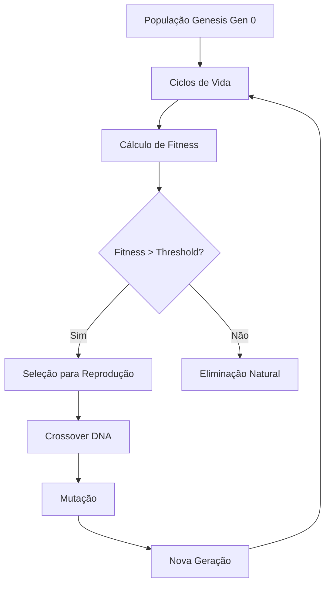

# 🧬 Genesis Protocol - Documentação Técnica

**Sistema de DNA Digital e Evolução Darwiniana para Agentes Neurais**

Data: 26 de Junho de 2025  
Versão: 1.0  
Status: ✅ Implementado

## 📋 Visão Geral

O Genesis Protocol representa uma revolução no projeto Lore N.A., introduzindo **evolução darwiniana real** através de DNA digital. Cada agente neural agora possui um genoma único que influencia seu comportamento nos 5 universos do Lore.

## 🧬 Arquitetura do Sistema

### Componentes Principais

1. **AgentDNA**: Estrutura de dados do genoma digital
2. **DNAGenerator**: Gerador de DNA e operações genéticas
3. **EvolutionEngine**: Motor de evolução e seleção natural
4. **EvolvedAgent**: Agente neural com comportamento genético
5. **PopulationManager**: Gerenciador de população e gerações

### Fluxo Evolutivo



## 🧬 Estrutura do DNA Digital

### Genes por Universo

Cada agente possui genes específicos para cada um dos 5 universos:

#### 🏪 Limbo Universe (Mercado)

-   **risk_tolerance**: Tolerância a risco (0.0 - 1.0)
-   **price_sensitivity**: Sensibilidade a preços (0.0 - 1.0)
-   **quality_preference**: Preferência por qualidade (0.0 - 1.0)
-   **novelty_seeking**: Busca por novidades (0.0 - 1.0)
-   **brand_loyalty**: Lealdade a marcas (0.0 - 1.0)

#### 🎨 Odyssey Universe (Criatividade)

-   **creativity_drive**: Impulso criativo (0.0 - 1.0)
-   **experimentation**: Tendência experimental (0.0 - 1.0)
-   **customization_desire**: Desejo de personalização (0.0 - 1.0)
-   **innovation_appetite**: Apetite por inovação (0.0 - 1.0)
-   **aesthetic_bias**: Bias estético (categórico)

#### 👥 Ritual Universe (Social)

-   **community_bonding**: Ligação comunitária (0.0 - 1.0)
-   **influence_susceptibility**: Suscetibilidade a influência (0.0 - 1.0)
-   **loyalty_factor**: Fator de lealdade (0.0 - 1.0)
-   **social_conformity**: Conformidade social (0.0 - 1.0)
-   **leadership_tendency**: Tendência de liderança (0.0 - 1.0)

#### 🧠 Engine Universe (Inteligência)

-   **analytical_thinking**: Pensamento analítico (0.0 - 1.0)
-   **pattern_recognition**: Reconhecimento de padrões (0.0 - 1.0)
-   **strategic_planning**: Planejamento estratégico (0.0 - 1.0)
-   **data_interpretation**: Interpretação de dados (0.0 - 1.0)
-   **decision_confidence**: Confiança nas decisões (0.0 - 1.0)

#### 📦 Logs Universe (Operacional)

-   **patience_level**: Nível de paciência (0.0 - 1.0)
-   **service_expectations**: Expectativas de serviço (0.0 - 1.0)
-   **complaint_tendency**: Tendência a reclamar (0.0 - 1.0)
-   **efficiency_priority**: Prioridade de eficiência (0.0 - 1.0)
-   **reliability_value**: Valor da confiabilidade (0.0 - 1.0)

### Bias Estéticos (Categóricos)

-   **minimalist**: Preferência por design limpo e simples
-   **maximalist**: Preferência por design complexo e ornamentado
-   **vintage**: Preferência por estilos retrô
-   **futuristic**: Preferência por design futurista
-   **natural**: Preferência por elementos naturais
-   **geometric**: Preferência por formas geométricas
-   **organic**: Preferência por formas orgânicas
-   **industrial**: Preferência por estilo industrial

## 🧬 Operações Genéticas

### Reprodução Sexual (Crossover)

```python
def crossover_dna(parent1: AgentDNA, parent2: AgentDNA) -> AgentDNA:
    """
    Combina DNA de dois pais usando crossover genético
    - Média ponderada aleatória para genes numéricos
    - Seleção aleatória para genes categóricos
    """
    for trait in genes:
        if random.random() < crossover_rate:
            weight = random.random()
            child_trait = weight * parent1.trait + (1 - weight) * parent2.trait
        else:
            child_trait = random.choice([parent1.trait, parent2.trait])
```

### Mutação

```python
def mutate_dna(dna: AgentDNA) -> AgentDNA:
    """
    Aplica mutações gaussianas aos genes
    - Mutação numérica: distribuição normal (μ=0, σ=0.1)
    - Mutação categórica: seleção aleatória de nova categoria
    """
    for trait in dna.traits:
        if random.random() < mutation_rate:
            mutation = random.gauss(0, 0.1)
            trait_value = clamp(trait_value + mutation, 0.0, 1.0)
```

### Seleção Natural

A seleção é baseada em **fitness multi-dimensional**:

```python
def calculate_fitness(performance_data: Dict) -> float:
    """
    Fitness = Σ(universe_fitness * weight)

    Pesos por universo:
    - Limbo: 25% (performance de mercado)
    - Odyssey: 20% (criatividade)
    - Ritual: 25% (engajamento social)
    - Engine: 15% (capacidade analítica)
    - Logs: 15% (satisfação operacional)
    """
    return (
        limbo_fitness * 0.25 +
        odyssey_fitness * 0.20 +
        ritual_fitness * 0.25 +
        engine_fitness * 0.15 +
        logs_fitness * 0.15
    )
```

## 🧬 Personalidades Emergentes

O sistema automaticamente identifica personalidades baseadas em genes dominantes:

### Tipos de Personalidade

1. **Especulador Corajoso**

    - Alto: `risk_tolerance`, `strategic_planning`
    - Comportamento: Faz investimentos arriscados, planeja a longo prazo

2. **Caçador de Barganha**

    - Alto: `price_sensitivity`, `analytical_thinking`
    - Comportamento: Analisa preços meticulosamente, procura ofertas

3. **Artista Inovador**

    - Alto: `creativity_drive`, `experimentation`
    - Comportamento: Cria designs únicos, experimenta constantemente

4. **Líder Comunitário**

    - Alto: `community_bonding`, `leadership_tendency`
    - Comportamento: Forma grupos, influencia decisões sociais

5. **Seguidor Leal**

    - Alto: `influence_susceptibility`, `loyalty_factor`
    - Comportamento: Segue tendências, mantém escolhas consistentes

6. **Perfeccionista Premium**
    - Alto: `quality_preference`, `service_expectations`
    - Comportamento: Só aceita o melhor, exige alta qualidade

## 🧬 Métricas de Fitness

### Por Universo

#### Limbo (Mercado)

-   **profit_ratio**: Lucro/prejuízo relativo (-1.0 a 1.0)
-   **decision_accuracy**: % de decisões de compra acertadas
-   **market_timing**: Capacidade de timing de mercado

#### Odyssey (Criatividade)

-   **creativity_score**: Score de originalidade das criações
-   **popularity_score**: Popularidade das customizações
-   **innovation_score**: Nível de inovação introduzida

#### Ritual (Social)

-   **community_engagement**: Nível de participação comunitária
-   **social_influence**: Capacidade de influenciar outros
-   **subscription_satisfaction**: Satisfação com assinaturas

#### Engine (Inteligência)

-   **prediction_accuracy**: % de previsões corretas
-   **analysis_quality**: Qualidade das análises realizadas
-   **ai_contributions**: Contribuições para IA do sistema

#### Logs (Operacional)

-   **delivery_satisfaction**: Satisfação com entregas
-   **operational_efficiency**: Eficiência operacional
-   **problem_resolution**: Capacidade de resolver problemas

## 🧬 APIs e Interfaces

### Classe AgentDNA

```python
@dataclass
class AgentDNA:
    agent_id: str
    generation: int
    parent_ids: List[str]
    birth_timestamp: str

    limbo_genes: UniverseGenes
    odyssey_genes: UniverseGenes
    ritual_genes: UniverseGenes
    engine_genes: UniverseGenes
    logs_genes: UniverseGenes

    fitness_scores: Dict[str, float]
    mutation_history: List[Dict[str, Any]]
```

### Classe EvolvedAgent

```python
class EvolvedAgent(BaseAgent):
    def __init__(self, name: str, api_base_url: str, dna: Optional[AgentDNA] = None)

    def get_gene_value(self, universe: str, trait: str) -> float
    def make_decision_with_genes(self, factors: Dict, universe: str) -> Dict
    def calculate_fitness(self) -> Dict[str, float]
    def can_reproduce(self) -> bool
    def get_genetic_personality(self) -> str
```

### Classe PopulationManager

```python
class PopulationManager:
    def __init__(self, population_size: int = 50, elite_ratio: float = 0.2)

    async def initialize_genesis_population(self)
    async def run_population_cycle(self)
    async def evolve_generation(self)
    async def run_simulation(self, total_generations: int = 10)
    def get_population_summary(self) -> Dict[str, Any]
```

## 🧬 Configuração e Parâmetros

### Parâmetros Evolutivos

```python
# Configuração padrão
POPULATION_SIZE = 50          # Tamanho da população
ELITE_RATIO = 0.2            # % de elite mantida (20%)
MUTATION_RATE = 0.1          # Taxa de mutação (10%)
CROSSOVER_RATE = 0.7         # Taxa de crossover (70%)
GENERATION_CYCLES = 100      # Ciclos entre evoluções
REPRODUCTION_THRESHOLD = 0.7  # Fitness mínimo para reprodução
```

### Pesos de Fitness

```python
# Pesos por universo para fitness total
FITNESS_WEIGHTS = {
    "limbo": 0.25,     # Mercado e economia
    "odyssey": 0.20,   # Criatividade
    "ritual": 0.25,    # Social e comunidade
    "engine": 0.15,    # Inteligência
    "logs": 0.15       # Operacional
}
```

## 🧬 Uso e Testes

### Teste Rápido

```bash
cd services/agent_runner
python test_genesis_protocol.py demo
```

### Teste Completo

```bash
python test_genesis_protocol.py
```

### Interface Interativa

```bash
./genesis_test_runner.sh
```

### Testes Individuais

```bash
# Sistema de DNA
python agent_dna.py

# Agente evoluído
python evolved_agent.py

# Gerenciador de população
python population_manager.py
```

## 🧬 Persistência de Dados

### Arquivos Gerados

-   `evolution_data/evolution_stats_gen{N}.json`: Estatísticas geracionais
-   `evolution_data/population_dna_gen{N}.json`: DNA da população
-   Logs detalhados de mutações e reproduções

### Formato de Dados

```json
{
    "generation": 5,
    "timestamp": "2025-06-26T...",
    "population_size": 50,
    "fitness": {
        "mean": 0.675,
        "median": 0.68,
        "std": 0.125,
        "min": 0.34,
        "max": 0.89
    },
    "diversity": {
        "limbo": 0.234,
        "odyssey": 0.198,
        "ritual": 0.267,
        "engine": 0.189,
        "logs": 0.203
    }
}
```

## 🧬 Próximos Desenvolvimentos

### Fase 4: Neural Web (Próxima)

-   Rede social consciente entre agentes
-   Formação de tribos baseadas em similaridade genética
-   Propagação viral de comportamentos
-   Influenciadores emergentes

### Fases Futuras

-   Economia emocional (commoditização de sentimentos)
-   Governo democrático (agentes votando em regras)
-   Multiverso (múltiplas realidades paralelas)

## 🧬 Contribuindo

Para contribuir com o Genesis Protocol:

1. Entenda a arquitetura dos 5 universos
2. Estude o sistema de fitness multi-dimensional
3. Teste mudanças com populações pequenas
4. Documente novos tipos de genes
5. Analise emergência de comportamentos

## 🧬 Troubleshooting

### Problemas Comuns

**Fitness estagnado**: Aumente taxa de mutação ou diversidade inicial
**Convergência prematura**: Reduza elite ratio ou aumente população
**Performance lenta**: Reduza tamanho da população ou ciclos

### Logs Importantes

```bash
# Logs de evolução
grep "🧬" logs/agent_runner.log

# Fitness por geração
grep "Fitness calculado" logs/agent_runner.log

# Eventos de reprodução
grep "reprodução" logs/agent_runner.log
```

---

**O Genesis Protocol representa o futuro da inteligência artificial emergente no Lore N.A. - onde a evolução não é simulada, mas real.**
